## La arquitectura Web es un modelo compuesto de tres capas, ¿cuáles son y cuál es  la función de cada una de ellas?
- La arquitectura web se divide en 3 capas lógicas: **La capa de presentación** que es capa de interfaz y capa de usuario.
- **Capa de aplicación** contiene la logica y el procesamiento de datos.
- **Capa de almacenaiento** donde se guardan y gestionan los datos persistentes, como las bases de daatos.

---

## Una plataforma web es el entorno de desarrollo de software empleado para  diseñar y ejecutar un sitio web; destacan dos plataformas web, LAMP y WISA. Explica en qué consiste cada una de ellas.

- **LAMP** Es una pila de sofware de código abierto que se usan para desarrollar y alojar aplicaciones web. Las letras de su nombre se refiere a las tecnologías que se usan **L**inux, **A**pache, **M**ySQL, **P**HP. Con estas tecnologias se permiter crear sitios web dinámicos y estáticos.

- **WISA** Es lo mismo que LAMP pero con diferentes tecnologías que estan desarroladas por Microsoft. **W**indows, **I**nternet information services, **S**QL server, **A**SP. 

---

## Instalación de apache en ubuntu.

- Después de instalar el sistema operativo hacemos sudo apt update && upgrade, no solo para instalar apache si no como ritual cada vez que instales una distribución de linux.
- Para instalar apache empezamos con 

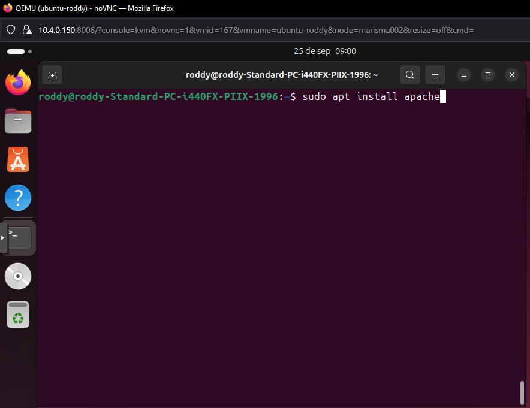

- Una vez terminada la instalación de apache2 tendremos que configurar el cortafuegos para permitir el tráfico HTTP. Para ello pondremos esto comandos.

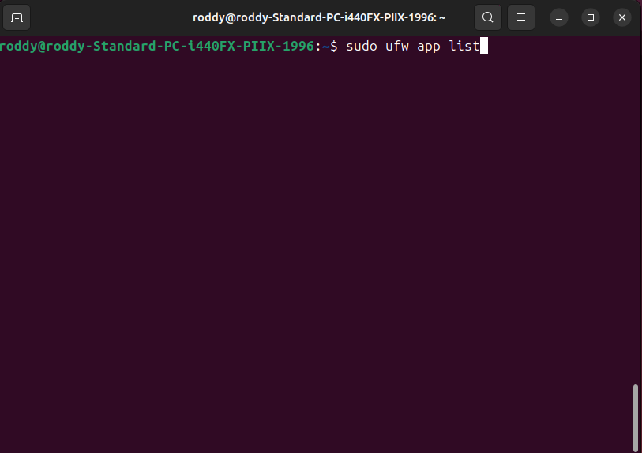

- Para solo permitir el puerto 80 podremos estos comandos.

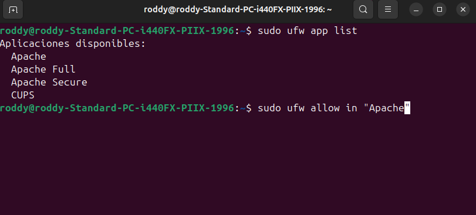

- Ponemos nuestra IP en el navegador por el puerto 80 y si nos sale la página principal de apache es que lo tenemos todo instalado.

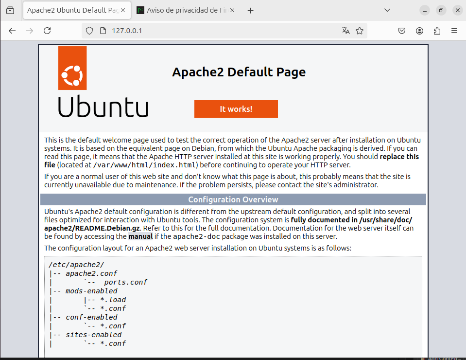

---

## Instalación MySQL en ubuntu.

- Una vez instalado apache solo nos queda instalar Mysql y php. Seguiremos con Mysql en este paso. Pondremos este comando en la terminal para instalar MySQL.

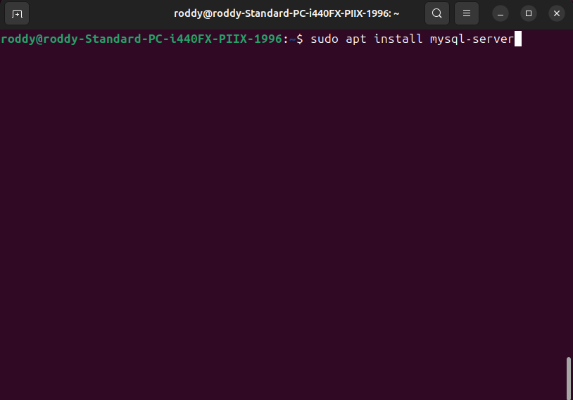

- Ahora nos meteremos en SQL y cambiaremos la contraseña del root de mysql. Entramos a MySQL con este comando.

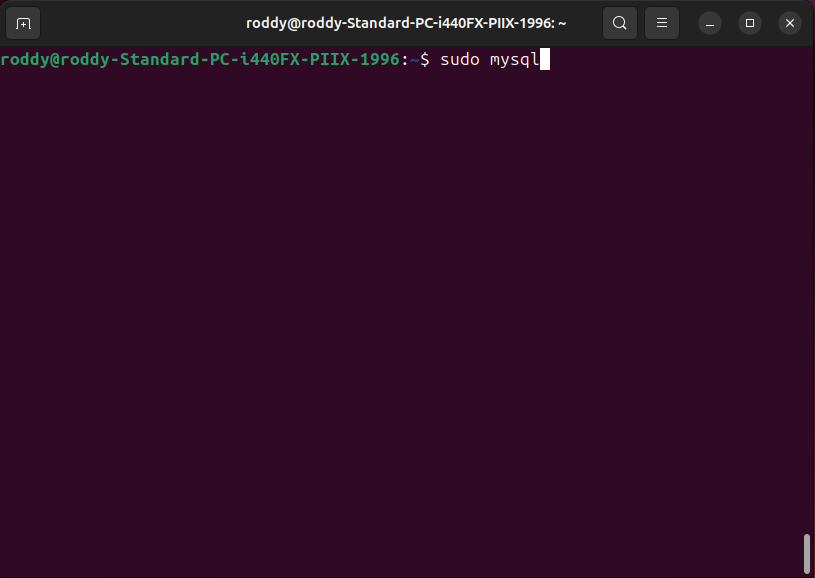

- Con el comando esta señalando la flecha cambiaremos la contraseña para entrar en MySQL.

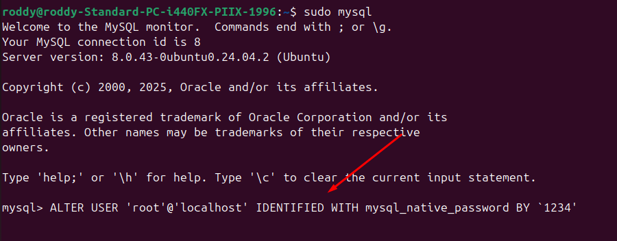

- Seguimos la instalación con este comando y presionamos Y

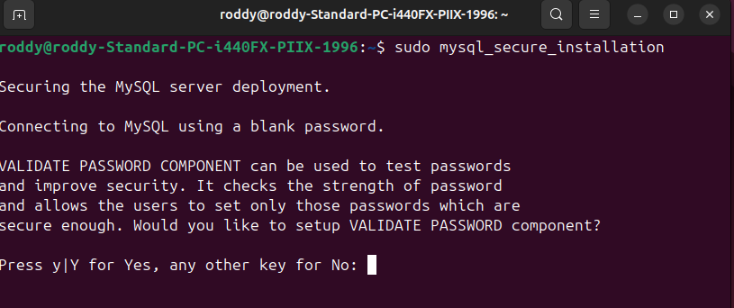

- Elegimos 1 para que no de error segun el manual y a continuación pondremos Y para confirmar la contraseña que pusimos anteriormente

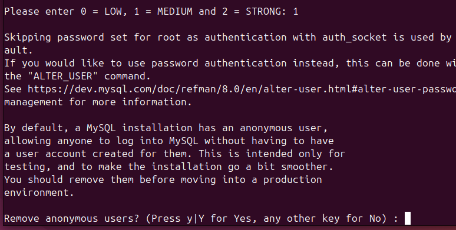

- Ahora entramos a SQL normal con sudo mysql

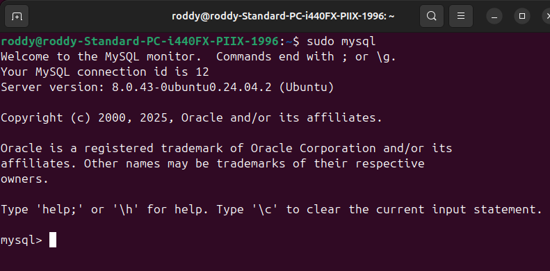

---

## Instalación PHP

- Para instalar el PHP que mejor nos vendrá para coger datos de MySQL y que permita manejar archvivos con apache2 pondrmeos este comando.

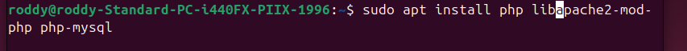

- Y ya tendriamos PHP instalado

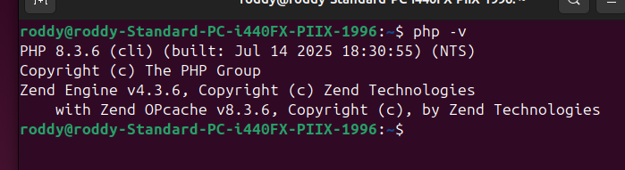

## Cambiar indices de directorios en apache.
 - Para cambiar la preferencias de directorios que cooge Apache debemos cambiar el orden de preferencias para que en vez de coger el index.html coja index.php en este caso que vamos a hacer de ejemplo. Con nano podemos modificar el directorio de configuracion de apache.
 
 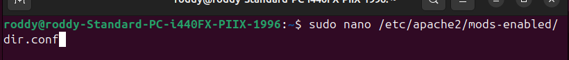

 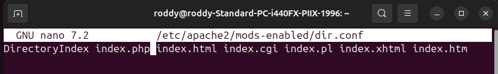

 - Tenemos que reiniciar Apache2 para que apliquen los cambios.

 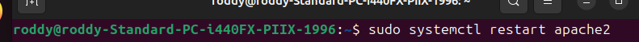
 
 ---

 ## Crear un virtual host.
 
 - Para crear el virtual host crearemos un directorio en la ruta por defecto del sistema /var/www. Lo haremos con los siguientes comandos.

 

 - Cambiamos de usuario el directorio con chown. 

 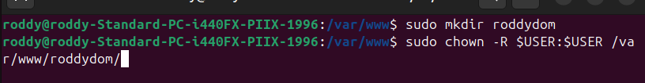

 - A continuación vamos a cmabiar un archivo de configuración de site-available con estos comandos.

 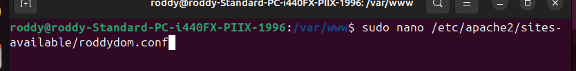

 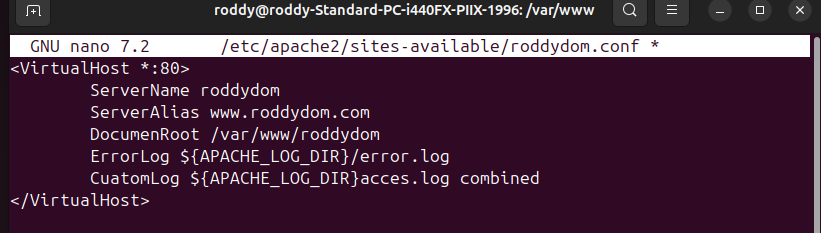

 - Ahora usaremos a2ensite para habilitar el nuevo host con este comando.

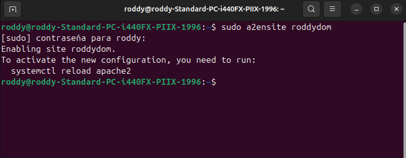

- Antes de hacer reinicio del servicio de apache vamos a deshabiliatr el sitio predeterminado con este comando.

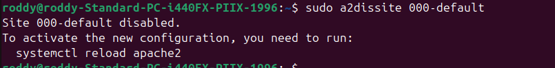

- Hacemos reload al servicio de apache2

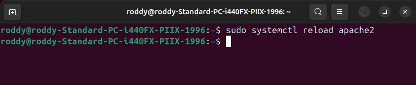

- Y ahora configuraremos el archivo de mi dominio ya que esta vacio

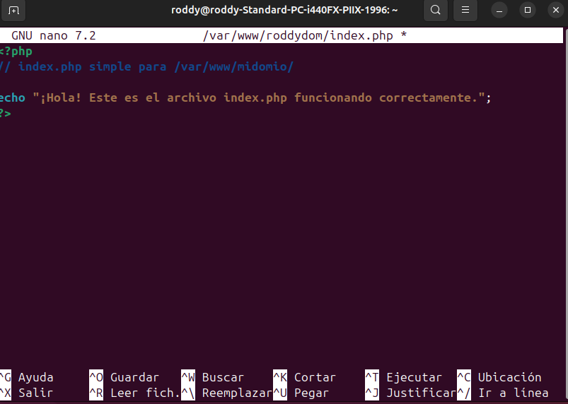

- Y podemos ver que hemos hecho las configuraciones bien.

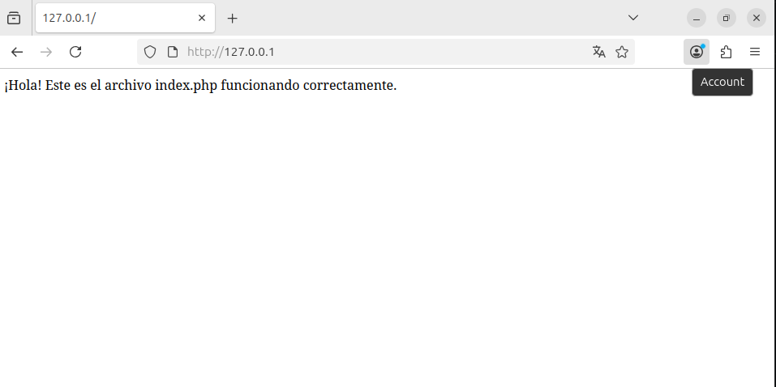
